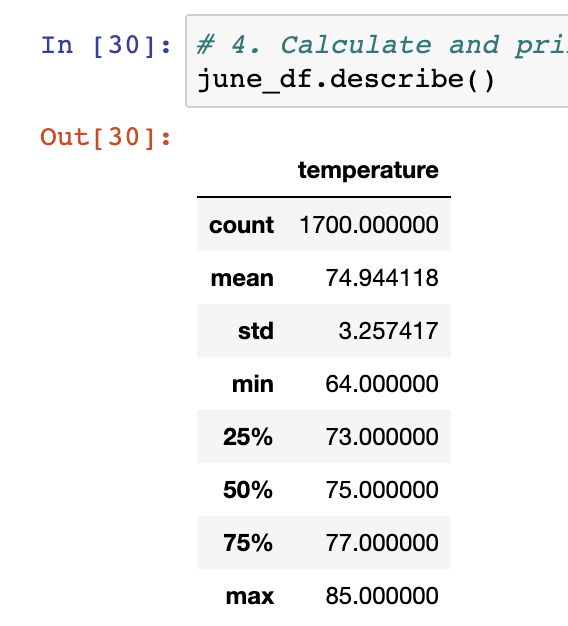
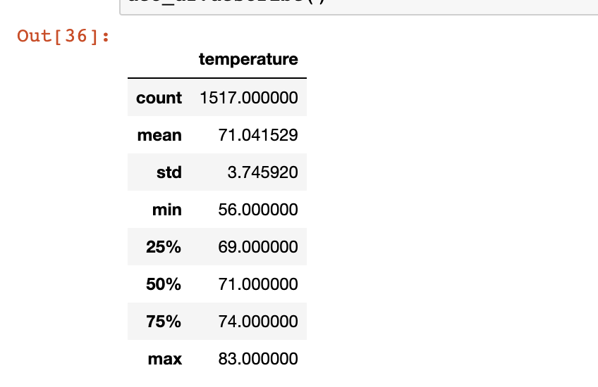
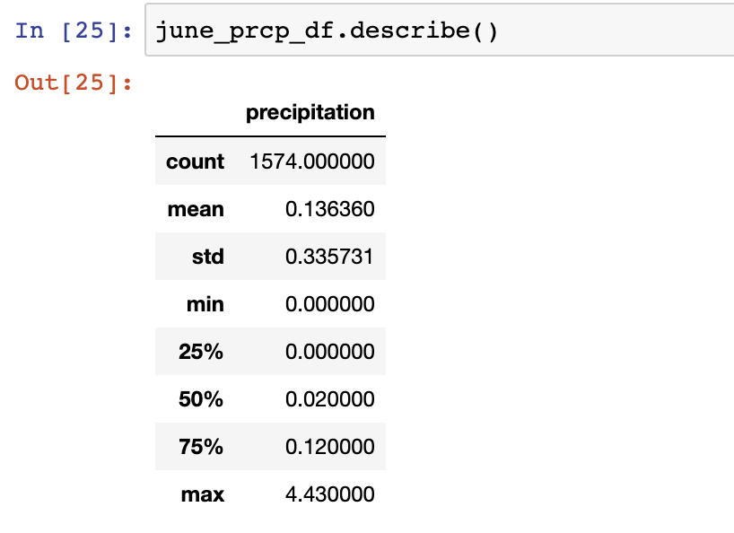
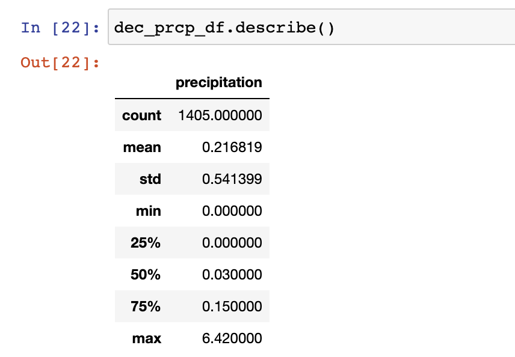

# Surfs Up
## Overview of the Analysis 
In this project, I am hoping to start a Surf and Shake shop in Hawaii. I have some capital to invest but need more in order to start the business. I reach out to an investor who loves surfing but would like more data that monitors the weather. The investor provides me a data set of weather from a simialr island. In this analysis, I am learning more about the Hawaiian weather and if a surf/shake shop could work in all months of the year. I am focusing primarily on the months of June and December. 

## Results 
To analyze each month, I focused on the date column from the measurement table to retrieve all of the temperatures. I then converted the temperatures in a list and then into a dataframe. 
Below is a picture of the June temperature summary statistics. 

Below is a picture of the June temperature summary statistics.

* Looking at the summary statistics from the month of June, I can see that the average June temperature is 74 degrees. This temperature will be great for surfing. 
* December's results are also positive. The average temperature is 71 degrees. While this is slightly cooler, I still think that there is a market for the Surf and Shake shop during this month. 
* June has a higher maximum temperature on file. June's maximum tempterature is 85 degrees whereas December's is 83 degrees. June appears to be a warmer month overall than December looking at the summary statistics. 

## Summary 
Based on the data above, I think that there is a little more research I need to perform in order to analyze the success of the shop. While I personally consider 71 and 74 degrees pretty warm, I would like to learn more about the temperature preferences for those living in Hawaii.

Another data point that I thought would be helpful is looking at the amount of rain in both June and December. Below is a picture of the summary statistics of precipitation in June. 

As you can see, there is not a heavy amount of rain. 

I also decided to look at December. 

While December is a slightly more rainy month, it once again does not look too bad. 

Overall, I think that the data for the Surf and Shake shop looks positive. I am excited to conduct more research to see if this could be a successful business venture. 
